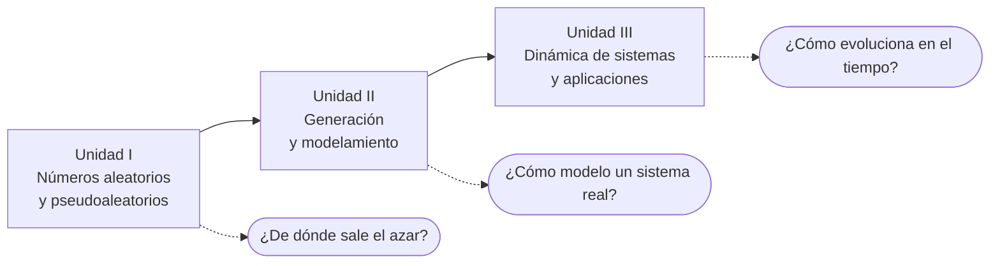

# 🎲 Simulación

**Universidad Militar Nueva Granada · Facultad de Educación a Distancia · Ingeniería Informática**

¡Bienvenido a la asignatura! En este curso vas a aprender a responder la pregunta *"¿qué pasaría si...?"* sin tener que arriesgar dinero, tiempo ni equipos reales. Construirás modelos de sistemas (una fila de atención, un inventario, una red de computadores), los alimentarás con números aleatorios y analizarás los resultados para tomar mejores decisiones.

> **Laboratorio interactivo:** abre la simulación del curso en tu navegador
> 👉 `https://dialejobv.github.io/Simulacion_U_Militar/`

---

## 📋 Ficha de la asignatura

| | |
|---|---|
| **Asignatura** | Simulación |
| **Programa** | Ingeniería Informática |
| **Área de formación** | Ciencias de la Ingeniería |
| **Semestre** | Séptimo |
| **Créditos académicos** | 3 |
| **Prerrequisitos** | Ninguno |
| **Docente** | *Diego Barragán* |

## 🎯 Lo que vas a lograr

Al terminar el curso serás capaz de:

- Definir con claridad los conceptos básicos de la simulación.
- Identificar las distribuciones de probabilidad implicadas en el modelamiento y aplicarlas a casos concretos.
- Aplicar la simulación de forma coherente en situaciones de producción, inventarios y líneas de espera.
- Usar herramientas informáticas para agilizar el modelamiento en las empresas.

## 🗺️ Ruta del curso

### Unidad I. Números aleatorios y pseudoaleatorios

- Números aleatorios y pseudoaleatorios
- Métodos congruenciales, de cuadrados medios y de productos medios
- Tipos de eventos: discretos (discretos y estocásticos) y continuos
- Simulación de eventos discretos

### Unidad II. Generación y modelamiento

- **Generadores:** métodos congruenciales y no congruenciales; propiedades de los números pseudoaleatorios (media, varianza e independencia)
- **Pruebas estadísticas:** de medias, de varianza, de uniformidad y de independencia
- **Variables aleatorias:** tipos de variable aleatoria y de distribuciones de un conjunto de datos
- **Pruebas de bondad de ajuste:** chi cuadrado, Kolmogorov-Smirnov y Anderson-Darling
- **Generación de variables aleatorias:** transformada inversa, convolución, aceptación y rechazo, composición
- **Modelamiento:** ajuste de datos con Stat::Fit; modelado con Excel, ProModel y FlexSim; aplicaciones a líneas de espera, inventarios y producción

### Unidad III. Dinámica de sistemas y aplicaciones

- **Dinámica de sistemas:** características estructurales y funcionales, tipos de trayectorias, bifurcaciones y catástrofes, diagramas causales, bucles de realimentación positivos y negativos, simbología y etapas para elaborar un modelo
- **Modelos y aplicaciones:** modelos de primer y segundo orden con ecuaciones diferenciales, modelado en Vensim, análisis de escenarios y casos aplicados a la ingeniería informática
- **Simulación:** solución de modelos con WinQSB, ProModel y Arena (opcional)

## 🧪 Laboratorio interactivo

El archivo [`index.html`](index.html) de este repositorio es una página con tres experimentos, uno por unidad. No requiere instalar nada: funciona en cualquier navegador.

| Unidad | Experimento | Qué puedes hacer |
|---|---|---|
| I | **¿Qué tan aleatorio es tu generador?** | Configurar un generador congruencial, de cuadrados medios o de productos medios; ver su histograma, su diagrama de dispersión y su periodo; y someterlo a las pruebas de medias, varianza, uniformidad e independencia. |
| II | **Mesa de ayuda: ¿cuántos técnicos hacen falta?** | Simular una línea de espera con llegadas y servicios exponenciales (generados por transformada inversa) y comparar los resultados con la teoría de colas M/M/c. |
| III | **Un malware recorre la red de la empresa** | Explorar un modelo de niveles y flujos, mover las tasas de contagio, limpieza y parcheo, y comparar escenarios. |

**Retos sugeridos**

1. En la Unidad I, carga el ejemplo *Con rejilla*. ¿Qué pruebas pasa y cuáles no? ¿Qué muestra el diagrama de dispersión que las pruebas de medias y varianza no detectan?
2. En la Unidad II, con 18 tiquetes por hora y técnicos que resuelven 10 por hora, ¿cuánto baja la espera al pasar de 2 a 3 técnicos? ¿Vale la pena el tercero?
3. En la Unidad III, fija un escenario de referencia y encuentra la tasa de parcheo mínima que reduce el pico de infectados a menos de la mitad.

## 🧑‍🏫 Metodología

El proceso de aprendizaje combina:

- Exposición de los temas por parte del docente
- Talleres y trabajos en clase
- Aprendizaje basado en la aplicación de software especializado al modelamiento de casos reales
- Trabajos de aplicación y profundización de temas específicos
- Evaluación global de los conocimientos y destrezas adquiridas

Las actividades, fechas y porcentajes de evaluación de cada corte se publican en el **Aula Virtual de la UMNG**.

## 🛠️ Software del curso

| Herramienta | Uso en el curso |
|---|---|
| Hoja de cálculo (Excel) | Generación de números, pruebas estadísticas y modelos sencillos |
| Stat::Fit | Ajuste de datos a distribuciones de probabilidad |
| ProModel | Simulación de eventos discretos |
| FlexSim | Simulación de eventos discretos |
| Vensim | Dinámica de sistemas |
| WinQSB | Solución de modelos de colas e inventarios |
| Arena (opcional) | Simulación de eventos discretos |

## 📚 Bibliografía

1. Azarang, M. R. y García, E. (1996). *Simulación y análisis de modelos estocásticos* (1.ª ed.). México: McGraw-Hill.
2. García, E. y García, L. (2006). *Simulación y análisis de sistemas con ProModel* (1.ª ed.). México: Prentice Hall.
3. Pardo, L. y Valdés, T. (1987). *Simulación* (1.ª ed.). Madrid: Díaz de Santos.

**Enlaces de interés**

- [IFORS](https://www.ifors.org), Federación Internacional de Sociedades de Investigación de Operaciones
- [INFORMS](https://www.informs.org), Instituto para la Investigación de Operaciones y las Ciencias de la Administración
- [ProModel](https://www.promodel.com)

